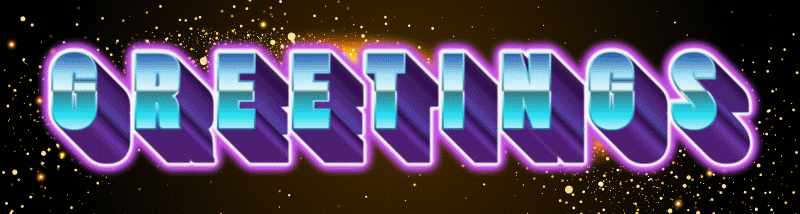
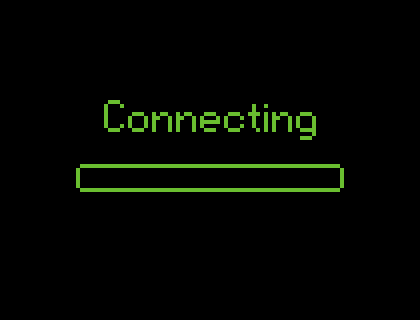

  <!-- Top Animated Cyber/AI Banner (Local Asset) -->
  

    

  <!-- Greetings GIF (Local Asset) -->
  

    

  <!-- Header Title -->
  <h1>
    
    Hi, I'm Yug Meshram
  </h1>

  <h3 align="center">AI & ML Enthusiast | Continuous Learner | Autonomous Systems Explorer</h3>

  <!-- Animated Typing Subtitle -->
  

    

  <!-- Social Badges -->
  

    
    &nbsp;
    
    &nbsp;
    
  

<!-- Line Divider Asset (Local Asset) -->

 

<!-- About Me Section with Local GIF (2.gif) -->
<table>
  <tr>
    <td width="58%" valign="top">
      <h2>🌱 About Me</h2>
      <ul>
        <li>🎓 <b>Education & Growth</b>: B.Tech Student in <b>Active Learning Phase</b> specializing in <b>Artificial Intelligence & Machine Learning</b>.</li>
        <li>🤖 <b>AI-Assisted Coding</b>: I actively leverage <b>AI tools & Generative AI co-pilots</b> to design, prototype, and accelerate software development.</li>
        <li>🚗 <b>Voice-Controlled Self-Driving Car</b>: Building real-time autonomous vehicle control pipelines using OpenAI Whisper, Deep Learning, and Udacity Simulator.</li>
        <li>🌿 <b>Smart Agriculture AI</b>: Developing leaf disease diagnostic models using PyTorch CNNs & web interfaces.</li>
        <li>💡 <b>Core Interests</b>: LLM Applications, Prompt Engineering, Edge AI, Computer Vision, and AI-Powered Workflows.</li>
        <li>🚀 <b>Motto</b>: <i>Continuous learning and building smart solutions by pairing human curiosity with AI capabilities.</i></li>
      </ul>
    </td>
    <td width="42%" align="center">
      <!-- Local Asset 2.gif -->
      
    </td>
  </tr>
</table>

 

<!-- Line Divider Asset -->

## 🚀 Featured Projects

<table width="100%">
  <tr>
    <td width="50%" valign="top">
      <h3>🚗 <a href="https://github.com/MeshramYug/self-driving-car">Voice-Controlled Self-Driving Car</a></h3>
      
Autonomous vehicle simulation integrating speech recognition (OpenAI Whisper / Groq LPU), PyTorch deep learning models, and Udacity simulator controls.

      

        
        
        
        
      

    </td>
    <td width="50%" valign="top">
      <h3>🌿 <a href="https://github.com/MeshramYug/Plant_Disease_Detection">Plant Disease Detection AI</a></h3>
      
AI-powered leaf disease diagnosis app built with PyTorch CNN models, Flask backend, modern UI, and smart treatment suggestions.

      

        
        
        
        
      

    </td>
  </tr>
</table>

 

<!-- Line Divider Asset -->

## 🛠️ Stack & Tools

<!-- Interactive Animated Skill Icons -->

  

 

### 🧠 AI Pair Programming & Coding Assistants

  
  
  
  

### 🤖 AI, Machine Learning & Computer Vision

  
  
  
  
  
  

### 💻 Core Programming Languages

  
  
  

### 🛠️ Environment & Infrastructure

  
  
  
  

 

<!-- Line Divider Asset -->

<!-- Active Learning Section with Local GIF (5.gif) -->
<table>
  <tr>
    <td width="58%" valign="top">
      <h2>📚 Active Learning Roadmap</h2>
      <ul>
        <li>🧠 <b>Core ML & DL Concepts</b>: Strengthening mathematical & architectural foundations.</li>
        <li>🤖 <b>AI-Powered Software Development</b>: Mastering prompt engineering & AI coding workflows.</li>
        <li>🎤 <b>Speech AI Pipelines</b>: Fine-tuning Whisper & voice intent models.</li>
        <li>🚗 <b>Autonomous Driving Systems</b>: Exploring lane control algorithms & sensor data.</li>
        <li>👁️ <b>Computer Vision</b>: Object detection & real-time video processing (YOLOv8, OpenCV).</li>
      </ul>
    </td>
    <td width="42%" align="center">
      <!-- Local Asset 5.gif -->
      
    </td>
  </tr>
</table>

 

<!-- Line Divider Asset -->

## 📊 GitHub Analytics

  
  

  

 

<!-- Activity Graph -->

  

 

## 🐍 Contribution Graph

  

 

## 💬 Random Developer Quote

  

 

## 📫 Connect With Me

  
  &nbsp;
  
  &nbsp;
  

 

  

---

### ⭐ Thanks for Visiting!

*"Continuously learning, experimenting, and leveraging AI tools to build intelligent autonomous and machine learning systems."*

